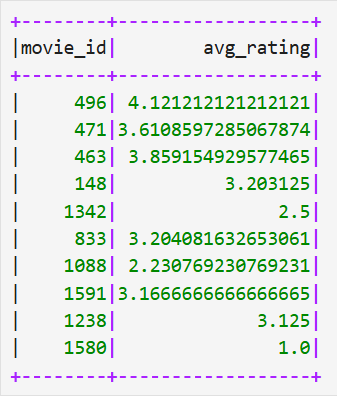
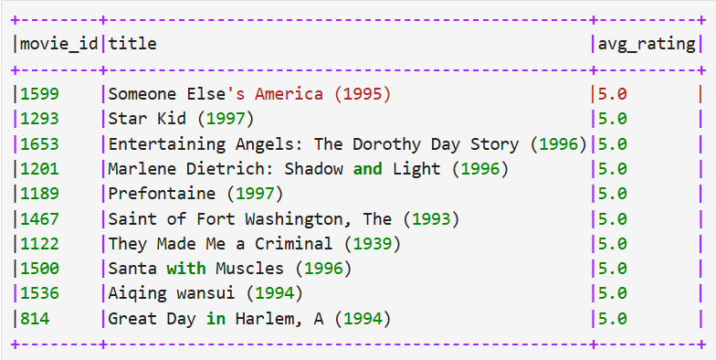
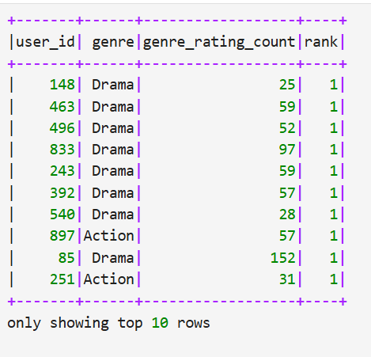
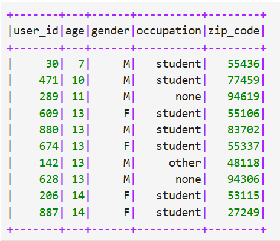
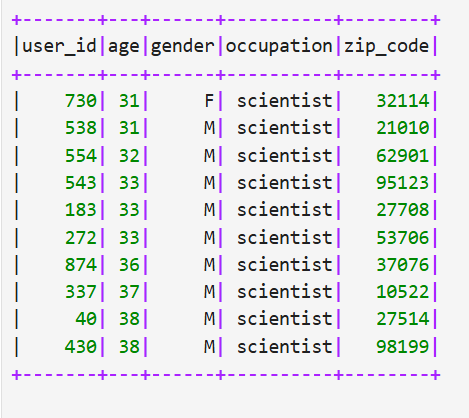

# A3
 Python script ：[function file-文件](Untitled15.md)

# Conduct query

## i) Calculate the average rating for each movie

from pyspark.sql.functions import avg
avg_rating_df = ratings_df.groupBy("movie_id").agg(avg("rating").alias("avg_rating"))
avg_rating_df.show(10)

##  ii) Identify the top ten movies with the highest average ratings
### First calculate the average ratings, then combine the movie names to select the top ten.
top_10_movies = avg_rating_df.join(movies_df, on="movie_id") \
                              .select("movie_id", "title", "avg_rating") \
                              .orderBy("avg_rating", ascending=False) \
                              .limit(10)
top_10_movies.show(truncate=False)

##iii) Find users who have rated at least 50 movies and identify their favourite movie genres
from pyspark.sql.functions import count, desc

### Step 1: Count the number of ratings for each user
active_users = ratings_df.groupBy("user_id") \
                         .agg(count("movie_id").alias("rating_count")) \
                         .filter("rating_count >= 50")

### Step 2: Expand the movie and genre into a long format.
from pyspark.sql.functions import lit

genre_columns = ["unknown", "Action", "Adventure", "Animation", "Children's", "Comedy", "Crime",
                 "Documentary", "Drama", "Fantasy", "Film-Noir", "Horror", "Musical",
                 "Mystery", "Romance", "Sci-Fi", "Thriller", "War", "Western"]

movie_genre_pairs = []
for genre in genre_columns:
    movie_genre_pairs.append(
        movies_df.select("movie_id")
        .where(movies_df[genre] == 1)
        .withColumn("genre", lit(genre))
    )
movie_genre_df = movie_genre_pairs[0]
for df in movie_genre_pairs[1:]:
    movie_genre_df = movie_genre_df.union(df)

### Step 3: Connect the rating data and the user table
user_genre_df = ratings_df.join(active_users, "user_id") \
                          .join(movie_genre_df, "movie_id")

### Step 4: Count each user's favorite movie genre (based on the genre with the most ratings)
from pyspark.sql.functions import row_number
from pyspark.sql.window import Window

genre_count = user_genre_df.groupBy("user_id", "genre") \
                           .agg(count("rating").alias("genre_rating_count"))

window_spec = Window.partitionBy("user_id").orderBy(desc("genre_rating_count"))

favourite_genres = genre_count.withColumn("rank", row_number().over(window_spec)) \
                              .filter("rank = 1")

favourite_genres.show(10)

##  iv) Find all the users who are less than 20 years old
users_df_from_cassandra.filter("age < 20") \
     .orderBy("age") \
     .limit(10) \
     .show()

##  v) Find all the users whose occupation is “scientist” and whose age is between 30 and 40 years old

users_df_from_cassandra.filter("occupation = 'scientist' AND age BETWEEN 30 AND 40") \
     .orderBy("age") \
     .limit(10) \
     .show() 

